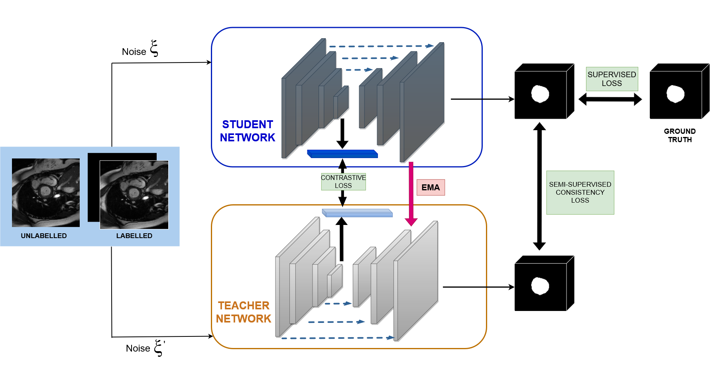

<div align="center">
   
## Semi-supervised Cardiac Image Segmentation Imposing a Contrastive Loss in the Mean Teacher Model
   
</div>

<p align="center">

</p>

## Data set

The original ACDC data set may be downloaded from: [ACDC data](https://www.creatis.insa-lyon.fr/Challenge/acdc/databases.html).

The data set provided in the 'data' folder is the pre-processed ACDC data, created using the code by Chaitanya et al which can be found here: [Pre-processing code](https://github.com/krishnabits001/domain_specific_cl)

* We evaluate our proposed semi-supervised method on the dataset of the Automated Cardiac Diagnosis Challende (ACDC) which consist of cine_MRI scnas of patients. The data set consists of training data and testing data. However, this code makes use of onlt the training data, which it will further split iinto training, validation and testing sets, in acoordance wiht similar papers of research. 

## Installation

To clone the repository:

git clone  INSERT HERE 

## Training

```
cd code
python train_mmt.py --gpu 0 --exp model_name
```

## Testing

```
python test_hierarchy.py --gpu 0 --model model_name
```


Any further information regarding the code may be found at the original site: [Original code we adpated](https://github.com/jacobzhaoziyuan/HCR-MT)


## Acknowledgement

The Code is adapted from an open-source codebase "Hierarchical Consistency Regularized Mean Teacher for Semi-supervised 3D Left Atrium Segmentation".
we thank these authors.

*  HCR-MT: https://github.com/jacobzhaoziyuan/HCR-MT
